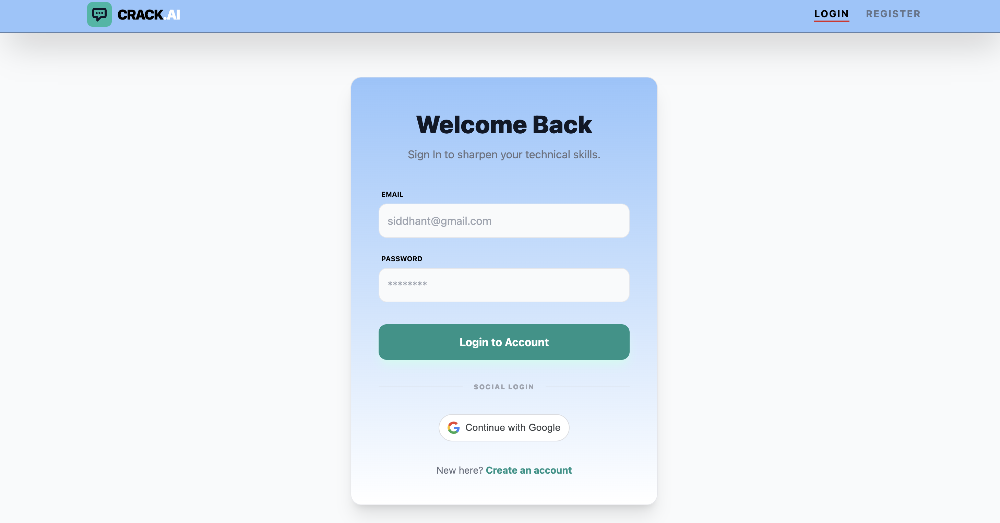
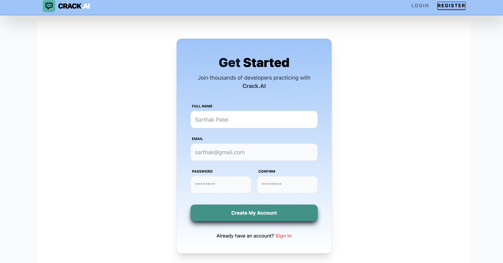
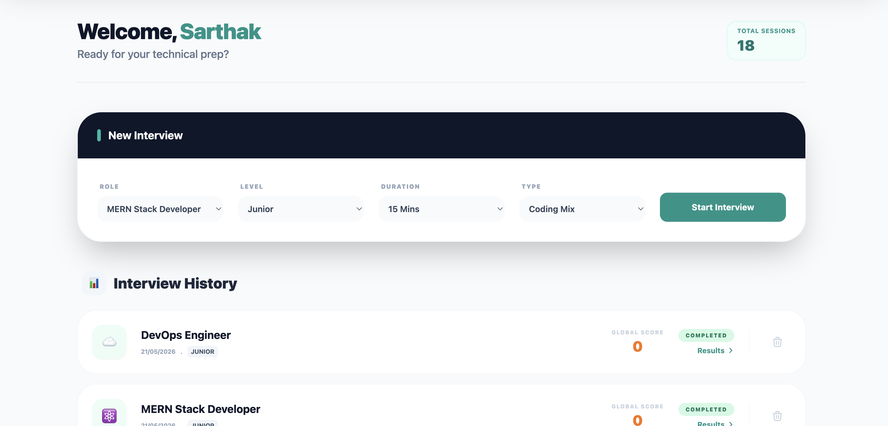
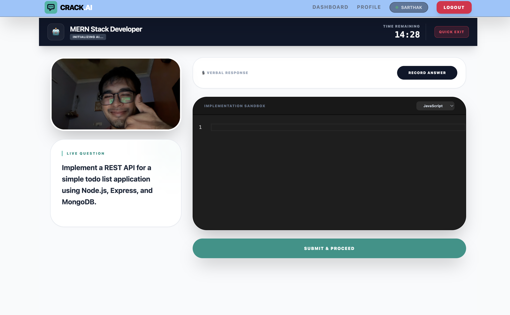
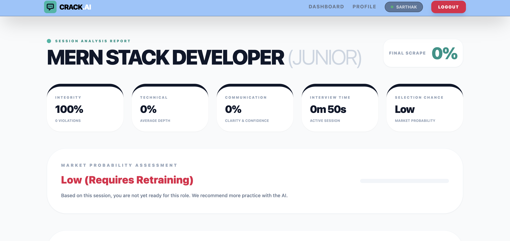
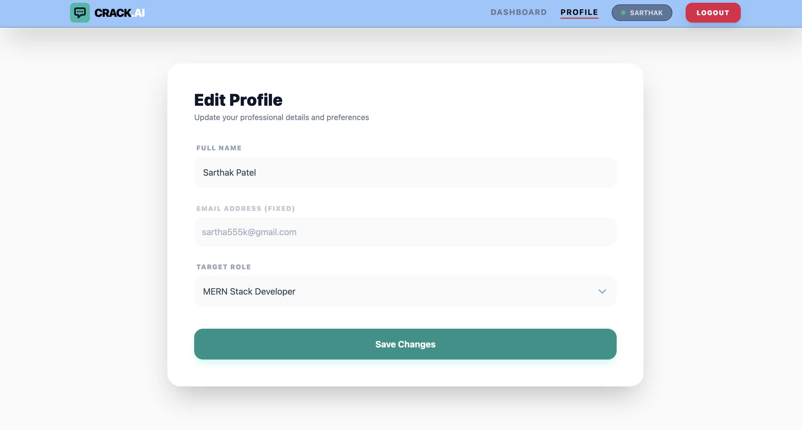
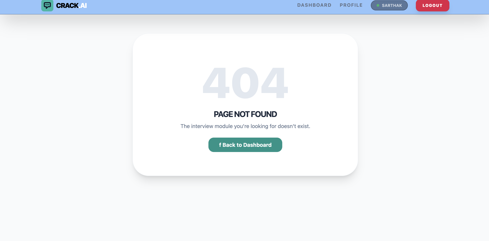

# crack.ai - AI-Powered Interview Preparation Platform

Welcome to **crack.ai**, an intelligent interview preparation platform that uses AI to conduct mock interviews, provide real-time feedback, and help you ace your job interviews.

## 🚀 Features

### 1. **User Authentication**

Secure user registration and login system with session management.

- Register new accounts with email and password
- Login with credential validation
- JWT-based authentication
- Protected routes for authenticated users

### 2. **Interview Sessions**

Create and manage mock interview sessions tailored to your needs.

- Create new interview sessions
- Select interview type and difficulty level
- Track session history
- View detailed session reviews and performance metrics
- Resume interrupted sessions

### 3. **Real-Time Interview Runner**

Live interview experience with AI-powered question generation and evaluation.

- Real-time interaction with AI interviewer
- Dynamic question generation based on difficulty
- Speech recognition and text input support
- Real-time feedback on answers
- Session recording and playback

### 4. **Performance Analytics**

Detailed performance tracking and insights.

- Session review with question-by-question analysis
- Score breakdown and metrics
- Feedback on communication and technical skills
- Progress tracking over multiple sessions

### 5. **User Profile Management**

Personalized user dashboard and settings.

- View and edit user profile
- Track interview history
- Manage session preferences
- View performance statistics

---

## 📋 API Routes

### **User Routes** (`/api/users`)

| Method | Endpoint    | Description                    |
| ------ | ----------- | ------------------------------ |
| POST   | `/register` | Register a new user            |
| POST   | `/login`    | Login user and get JWT token   |
| GET    | `/profile`  | Get authenticated user profile |
| PUT    | `/profile`  | Update user profile            |
| POST   | `/logout`   | Logout user                    |

### **Session Routes** (`/api/sessions`)

| Method | Endpoint      | Description                    |
| ------ | ------------- | ------------------------------ |
| POST   | `/`           | Create a new interview session |
| GET    | `/`           | Get all sessions for user      |
| GET    | `/:id`        | Get session details by ID      |
| PUT    | `/:id`        | Update session progress        |
| DELETE | `/:id`        | Delete a session               |
| GET    | `/:id/review` | Get detailed session review    |

---

## 📄 Pages & Components

### **1. Login Page** (`/login`)

- User authentication interface
- Email and password input
- Login button with validation
- Link to registration page
- Error handling for failed login attempts

**Screenshot:**


---

### **2. Register Page** (`/register`)

- New user registration form
- Email, password, and confirm password fields
- Form validation
- Terms and conditions acceptance
- Link to login page

**Screenshot:**


---

### **3. Dashboard** (`/dashboard`)

- Overview of user's interview sessions
- Quick stats (total interviews, average score)
- List of recent sessions with SessionCard components
- Create new session button
- Filter and sort options

**Screenshot:**


---

### **4. Interview Runner** (`/interview/:sessionId`)

- Live interview interface
- AI question display
- Answer input area (text/voice)
- Timer for each question
- Submit answer button
- Progress indicator
- Real-time feedback display

**Screenshot:**


---

### **5. Session Review** (`/session/:sessionId/review`)

- Detailed review of completed interview
- Question-by-question breakdown
- Your answers vs. expected answers
- Score and metrics
- AI-generated feedback
- Download report option

**Screenshot:**


---

### **6. Profile Page** (`/profile`)

- User profile information display
- Edit profile details
- Change password
- View interview statistics
- Preferences and settings

**Screenshot:**


---

### **7. Not Found Page** (`*`)

- 404 error page
- Navigation links to main pages

**Screenshot:**


---

## 🏗️ Project Structure

### **Backend** (`/backend`)

```
backend/
├── server.js                 # Express server entry point
├── package.json              # Dependencies
├── .env                      # Environment variables
├── config/
│   └── db.js                # Database configuration
├── controllers/
│   ├── userController.js    # User logic
│   └── sessionController.js # Session logic
├── middleware/
│   ├── authMiddleware.js    # JWT authentication
│   ├── errorMiddleware.js   # Error handling
│   └── uploadMiddleware.js  # File upload handling
├── models/
│   ├── User.js              # User schema
│   └── SessionModel.js      # Session schema
├── routes/
│   ├── userRoutes.js        # User endpoints
│   └── sessionRoutes.js     # Session endpoints
└── uploads/                 # Session recordings storage
```

### **Frontend** (`/frontend`)

```
frontend/
├── src/
│   ├── main.jsx             # React entry point
│   ├── App.jsx              # Root component
│   ├── index.css            # Global styles
│   ├── components/
│   │   ├── Header.jsx       # Navigation header
│   │   ├── Modal.jsx        # Reusable modal
│   │   ├── PrivateRoute.jsx # Protected routes
│   │   └── SessionCard.jsx  # Session display card
│   ├── pages/
│   │   ├── Login.jsx
│   │   ├── Register.jsx
│   │   ├── Dashboard.jsx
│   │   ├── InterviewRunner.jsx
│   │   ├── SessionReview.jsx
│   │   ├── Profile.jsx
│   │   └── NotFound.jsx
│   ├── features/
│   │   ├── auth/
│   │   │   └── authSlice.js # Redux auth state
│   │   └── session/
│   │       └── sessionSlice.js # Redux session state
│   ├── hooks/
│   │   └── useSocket.js     # WebSocket custom hook
│   └── app/
│       └── store.js         # Redux store
├── vite.config.js           # Vite configuration
├── tailwind.config.js       # Tailwind CSS config
└── package.json
```

### **AI Services** (`/ai-services`)

```
ai-services/
├── main.py                  # Python service entry
├── requirements.txt         # Python dependencies
└── .gitignore
```

---

## 🛠️ Tech Stack

**Frontend:**

- React 18+ with Vite
- Redux Toolkit for state management
- Tailwind CSS for styling
- WebSocket for real-time communication

**Backend:**

- Node.js with Express
- MongoDB for database
- JWT for authentication
- Socket.io for real-time features

**AI Services:**

- Python backend
- Natural Language Processing
- Speech Recognition

---

## 🚀 Getting Started

### Installation

**Backend:**

```bash
cd backend
npm install
npm start
```

**Frontend:**

```bash
cd frontend
npm install
npm run dev
```

**AI Services:**

```bash
cd ai-services
pip install -r requirements.txt
python main.py
```

---

## 📝 Environment Variables

Create `.env` files in backend and frontend directories with necessary configuration.

---

## 🤝 Contributing

Pull requests are welcome. For major changes, please open an issue first.

---

## 📄 License

MIT License - feel free to use this project!
